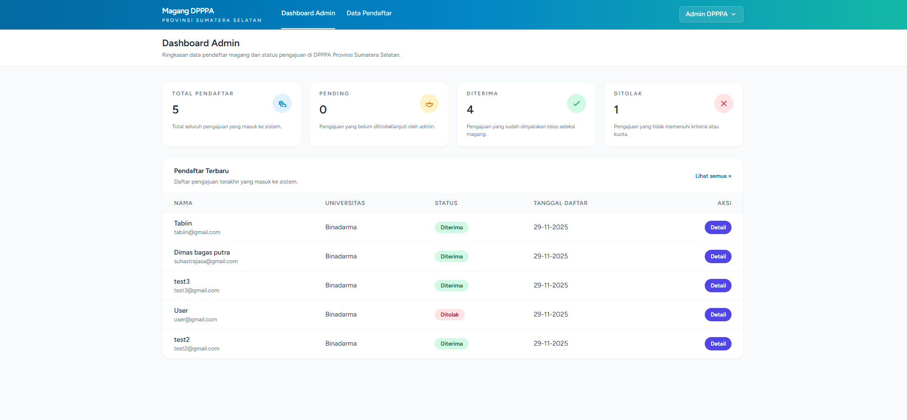
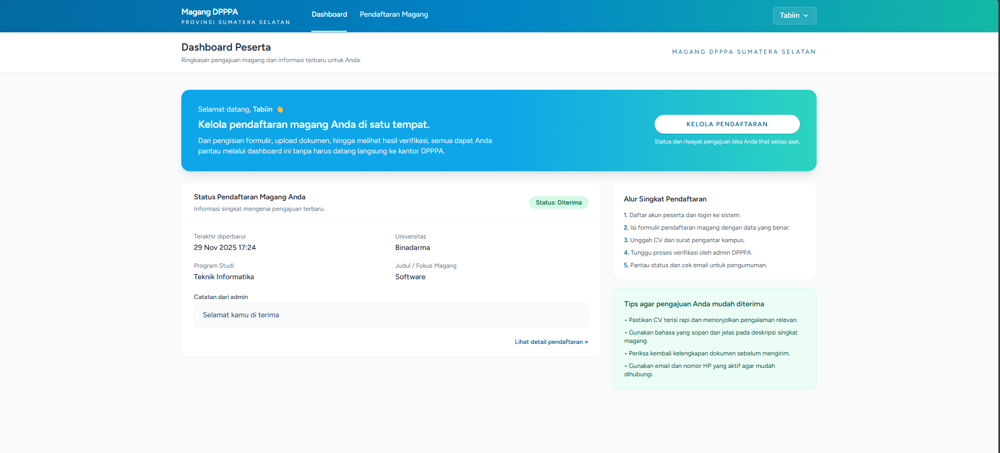
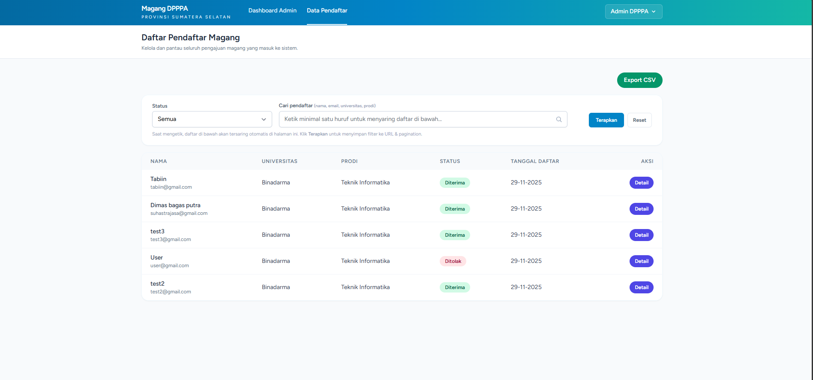
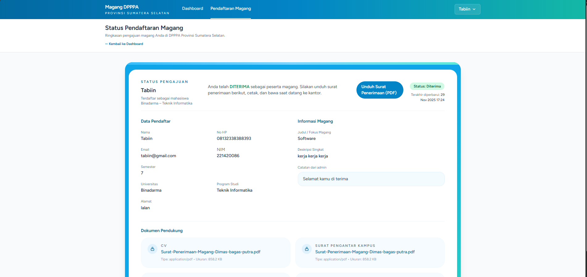

# Website Pendaftaran Magang – DP3A Provinsi Sumatera Selatan

Aplikasi web berbasis Laravel untuk pendaftaran magang secara online di
**Dinas Pemberdayaan Perempuan dan Perlindungan Anak (DP3A) Provinsi Sumsel**.

Peserta bisa daftar, upload dokumen, dan memantau status pengajuan.  
Admin bisa memeriksa data, mengubah status, mengatur tanggal magang, mengirim email notifikasi, dan ekspor CSV.

---

## ✨ Fitur Utama

### Untuk Peserta

- Registrasi akun peserta + login.
- Form **pendaftaran magang**:
  - Data diri (nama, email, no HP, NIM, universitas, prodi, semester, alamat).
  - Judul/fokus magang dan deskripsi singkat/motivasi.
  - Upload dokumen:
    - CV (wajib)
    - Surat pengantar kampus (wajib)
    - KTM (opsional)
    - KTP (opsional)
- Halaman **Dashboard Peserta**:
  - Ringkasan status pengajuan (Pending / Diterima / Ditolak).
  - Catatan dari admin.
  - Informasi tanggal mulai & selesai (jika sudah diterima).
- Halaman **Status Pendaftaran Detail**:
  - Data lengkap pendaftar.
  - Daftar dokumen yang di-upload.
- Download **Surat Penerimaan Magang (PDF)** kalau status sudah `diterima`.

### Untuk Admin

- Dashboard Admin:
  - Total pendaftar, jumlah pending / diterima / ditolak.
  - Tabel pendaftar terbaru.
- Halaman **Daftar Pendaftar**:
  - Filter berdasarkan status (Semua, Pending, Diterima, Ditolak).
  - Pencarian (nama, email, universitas, prodi).
  - Tombol “Detail” untuk tiap pendaftar.
  - Tombol **Export CSV** (seluruh data pendaftar).
- Halaman **Detail Pendaftar**:
  - Data lengkap peserta.
  - Dokumen pendukung (CV, surat pengantar, KTM, KTP) dengan desain kartu.
  - Form update status + catatan admin.
  - Input **tanggal mulai** dan **tanggal selesai** magang (wajib diisi kalau status `diterima`).
  - Saat status diubah, sistem mengirim **email notifikasi** ke peserta.

---

## 🧱 Teknologi yang Digunakan

- **Laravel** (versi 10/11/12 – sesuai composer di project ini)
- **PHP** 8.1/8.2
- **MySQL / MariaDB**
- **Tailwind CSS** (via Laravel Breeze / Vite)
- **Mailtrap** untuk testing email (sandbox)
- **barryvdh/laravel-dompdf** untuk generate PDF surat penerimaan
- GitHub sebagai repositori kode

---

## 📸 Screenshot / Demo

### Dashboard Admin 

### Dashboard Peserta

### Data Peserta Yang di Akses Admin 

### Status Pendaftaran Peserta 

## 💻 Requirements

Sebelum menjalankan project ini di laptop lain, pastikan sudah ter-install:

- PHP ≥ 8.1  
- Composer  
- MySQL / MariaDB (bisa lewat XAMPP/Laragon, dll.)  
- Node.js + NPM  
- Git (opsional tapi disarankan)

---

## 🚀 Cara Menjalankan

Langkah berikut diasumsikan dijalankan di Windows (XAMPP), tapi di OS lain konsepnya sama.

### 1. Clone Repository
git clone https://github.com/suhastral3/Website-Pendaftaran-Magang.git
cd Website-Pendaftaran-Magang

2. Install Dependency PHP & JS
composer install
npm install

Kalau pakai npm versi baru, boleh juga:
npm install --legacy-peer-deps

4. Buat File .env
Salin dari example:
cp .env.example .env

Lalu edit .env dan sesuaikan:
APP_NAME="Sistem Pendaftaran Magang"
APP_ENV=local
APP_DEBUG=true
APP_URL=http://localhost:8000   # atau http://127.0.0.1:8000

# Koneksi database (sesuaikan dengan XAMPP / MySQL di laptop)
DB_CONNECTION=mysql
DB_HOST=127.0.0.1
DB_PORT=3306
DB_DATABASE=magang_dpppa      # buat database ini dulu di phpMyAdmin
DB_USERNAME=root             # default XAMPP
DB_PASSWORD=                 # biasanya kosong di XAMPP

4. Konfigurasi Mailtrap (Opsional tapi disarankan)
Aplikasi ini menggunakan Mailtrap untuk testing email (tidak mengirim ke email sungguhan).
Di Mailtrap, buat Inbox baru, lalu ambil konfigurasi SMTP dan masukkan ke .env:

MAIL_MAILER=smtp
MAIL_HOST=sandbox.smtp.mailtrap.io
MAIL_PORT=2525
MAIL_USERNAME=xxxxxxxxxxxxxx
MAIL_PASSWORD=xxxxxxxxxxxxxx
MAIL_ENCRYPTION=tls
MAIL_FROM_ADDRESS="no-reply@magang.test"
MAIL_FROM_NAME="Sistem Pendaftaran Magang"

Kalau dibiarkan default Mailtrap, email tidak akan masuk ke Gmail peserta, tapi akan muncul di dashboard Mailtrap.
Untuk produksi, ganti konfigurasi SMTP dengan server email sungguhan (misal Gmail SMTP, layanan email perusahaan, dll.)

5. Generate App Key
php artisan key:generate

6. Migrasi Database & Seeder Admin
Jalankan:
php artisan migrate --seed

Perintah ini akan:
Membuat semua tabel yang dibutuhkan.
Membuat akun admin default dari AdminUserSeeder.

Akun Admin Default:
Email: admin@magang.test
Password: password123

Silakan ubah password ini dari halaman admin setelah login.

7. Buat Storage Link (untuk file upload)
php artisan storage:link
Ini supaya file yang di-upload (CV, surat pengantar, KTP, KTM) bisa diakses via public/storage.

8. Jalankan Server & Build Asset
Jalankan backend Laravel:
php artisan serve

Jalankan frontend (Tailwind + JS) – pilih salah satu:

Untuk development (live reload):

npm run dev

Untuk build produksi:

npm run build

Kalau sudah, buka di browser:

http://127.0.0.1:8000
